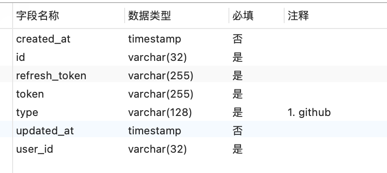

# 自动化部署工具 - 简单 - 基础 - 容易二次开发

# 设计并实现一个简单自动化部署工具

说之前先放地址 https://cycle.bucai.cc/，开发环境运行的，有点慢请耐心等待加载。

GitHub: https://github.com/notbucai/cb-cycle

这是我尝试用流程化的思路进行项目开发实现的记录。

至于为什么不适用市面上现有且完善的框架，是因为我好久没写完整且有意义的东西了，当然依然会“借鉴”一些成熟的项目。

## 设计

### 需求来源

近期间歇性踌躇满志的对博客功能点进行升级、优化，该项目分为后台nestjs项目、前台nuxtjs、管理系统vue.js，目前部署方式采用Docker进行本地的镜像编译后push到私有仓库后再进入服务器pull之后重启。还有是多人协作开发每个人都需要在本地安装服务器环境（Docker等）来确保环境一致性。

通过上述描述不难发现：

1. 由于项目使用的模版、语言以及部署后的状态（静态、服务）都有区别导致编译方式无法统一。
2. 目前的手动部署流程的重复性问题。
3. 需要匹配服务器环境，本地开发电脑配置要求高。

### 目标期望

1. 项目部署模版化，针对不同类型可选择不同模板进行打包。
2. 将手动部署过渡成自动化部署。
3. 依赖分支监控，push自动触发部署，解决本地配置要求高。

### 调研

因为大多数人平时工作中都接触是有需要这套工具的，所以调研简单说明。

调研目标：Netlify（国外）、腾讯云Webify（国内）。

#### 它们解决了什么问题

1. 将资源进行部署。
2. CI/CD 工作流。

#### 它们的缺点（~~强行提高现在所做的项目高度~~）

1. Netlify 国外，dddd。
2. Webify云厂商进行运维，保不齐什么时候就开始割韭菜。

### 需求分析

通过上述内容很直观的得到项目需要功能点。

#### 核心分析

核心功能是以“任务”为单元进行操作，创建任务和管理任务。

所谓“任务”即需要对状态进行流转的，目前任务分为 进行中、失败、已停止。

每次触发都应该生成一个子任务，如果触发时有进行中的子任务应当停止后启用新任务。

进行中的任务包含子状态：编译中、编译成功、编译失败。


用户交互以及核心环节请看下方流程图。


#### 功能设计

1. 创建任务

   主要对某个仓库的分支进行webhook的注册，并将任务信息写入数据库。

2. 管理任务

   主要对创建后的任务信息进行管理，删除、暂停、开始。

   1. 开始 

      对暂停的任务继续进行。

   2. 暂停

      对正在进行中的任务进行。

   3. 删除

      删除此条数据，并删除webhook。

3. 任务执行

   通过webhook触发执行，找到当前数据进行执行。

#### 任务执行设计

如何不同配置进行不同的编译/运行方式？

所有编译都采用docker进行隔离编译，运行根据不同类型进行选择不同的方式。

目前区分两种类型，一种是静态、一种是动态：

- 静态：采用采用docker编译后上传cdn方式，当然只是模拟暂只放nginx静态目录中。
- 动态：使用docker编译后docker运行。

|      web       |    service     |
| :------------: | :------------: |
|    无需端口    |      端口      |
| nginx 转发资源 | nginx 转发端口 |
|  可能需要编译  |  可能需要编译  |
| 不需要容器运行 |  需要容器运行  |

| 动作 | spa项目 | 普通网页 | Ts node 项目 | 普通node项目 |
| :--: | :-----: | :------: | :----------: | :----------: |
| 构建 |   是    |    否    |      是      |      是      |
| 编译 |   是    |    否    |      是      |      否      |
| 运行 |   否    |    否    |      是      |      是      |

上方从资源类型和项目类型进行对比，直观的表达了任务的执行动作。

静态资源（web）容器构建后，通过docker cp 将镜像中dist数据copy到主机中，然后转移到nginx中。

服务资源（service）容器构建编译后，再运行起来，然后添加nginx将容器映射到机器端口上。

端口后续进行维护，容器内端口不做管理，靠nginx容器进行映射维护。

用户自己的任务容器之间可以相互通信，通过任务id即可访问，如果是静态资源需要访问后续通过配置将接口进行转发，同时用户可以绑定自己的域名到当前机器上。

#### 页面设计

前端采用`naive-ui`作为前端布局样式组件。

其在交互上主要分为三步：

1. 选择托管平台

   github、gitee等平台，选择的托管平台必须是授权登录过的。

2. 输入信息

   输入任务所必须的数据字段

3. 确认信息

   确认输入的是否符合要求

由于设计比较简单，直接以图片形式展示。


任务列表字段：任务名称/ID、托管平台、模版、状态、创建人、创建时间、更新时间、操作时间。


详情页


#### 数据库设计

只展示核心表的设计


用户表


托管平台表



模版表


任务表


子任务表


#### 接口设计

包含crud，直接查看接口文档：

https://www.apifox.cn/apidoc/project-741496/api-14138505

### 技术选型

选择的方案的标准是 `我会`、`简单` 。

目前选择`egg + mysql + redis + vue`架构，编码尽量ts化。其他框架也考虑过比如nestjs、koa，相对而言nest太大了，koa又太小了，选 vue 其实只是想试一下3.x的版本。

[eggjs](https://www.eggjs.org/):  为企业级框架和应用而生。

[vue](https://v3.cn.vuejs.org/): 懂得都懂。

### 项目架构

架构很简单，就是存储配合依赖进行触发。


#### 服务器运维架构


独立当前应用，用户可共享自己的服务并独立运行（隔离），原则上每个用户都可以申请一些存储与其他资源（待定），不过仍然建议使用远程/第三方资源。

#### 编译/部署 触发 流程


是否编译：有些node项目是不需要编译的步骤

是否运行：静态资源不需要运行，直接打到nginx中即可

## 实现

核心功能实现（暂时只做实现 github 相关业务，其他平台预留接口）。

[项目进度查看](https://github.com/users/notbucai/projects/1)


#### 绑定托管平台

	引用阮一峰一图，[一文](https://www.ruanyifeng.com/blog/2014/05/oauth_2_0.html)，绑定流程基本上就是浏览器重定向，后返回code，拿到code换token，然后将token保存。

#### 获取相关信息

通过以下api进行操作

[用户储存库列表](https://docs.github.com/cn/rest/reference/repos#list-repositories-for-a-user)

[获取分支列表](https://docs.github.com/cn/rest/reference/branches#list-branches)

[获取指定文件内容](https://docs.github.com/cn/rest/reference/repos#get-repository-content)	

#### 创建任务

 创建任务写入 webhook。

[创建webhook](https://docs.github.com/cn/rest/reference/webhooks#create-a-repository-webhook)

#### 任务执行

等待webhook回调

[https://docs.github.com/cn/developers/webhooks-and-events/webhooks/testing-webhooks](https://docs.github.com/cn/developers/webhooks-and-events/webhooks/testing-webhooks)

任务执行相关模版每次触发都执行，使用ejs进行配置渲染生成。

```javascript
// 注入内容
{
  user, // 数据库user model
  task, // 数据库task model
  taskChild, // 数据库task_child model
  template, // 数据库template
  path: {
    ...path, // 相关路径
    code: relativeCodePath // 代码与配置的相对位置
  }
}
```

```dockerfile
# dock er file
FROM node:12.18.2

LABEL maintainer="<%= user.id %><<%= user.email %>>"

ADD <%= path.code %> /app/

WORKDIR /app

RUN rm -rf node_modules

RUN rm -rf <%= path.build %>

RUN npm config set sharp_binary_host https://npm.taobao.org/mirrors/sharp

RUN npm config set sharp_libvips_binary_host https://npm.taobao.org/mirrors/sharp-libvips

RUN npm config set sass_binary_site https://npm.taobao.org/mirrors/node-sass

RUN npm install --registry https://registry.npm.taobao.org --max-old-space-size=4096

ENV NODE_ENV production

<% if (template.is_build) { %>
RUN npm run <%= task.build_script %>
<% } %>

<% if (template.is_run) { %>
EXPOSE <%= task.server_port %>

CMD  nohup sh -c 'npm run <%= task.run_script %>'
<% } %>
```

```yaml
# docker compose config
version: "3.7"

services:
  "<%= task.id %>":
    build: .
    image: <%= task.id %>:<%= taskChild.version || '0.0.1' %>
    container_name: <%= task.id %>
    restart: always
<% if (template.is_run) { %>
    networks:
      <%= user.id %>-network:
        ipv4_address: <%= task.ip %>

networks:
  <%= user.id %>-network:
    external: true
<% } %>
```

#### 构建/编译/运行 相关

`node child_process exec `进行命令执行：

使用 ` exec('docker-compose build')`进行镜像的构建。

使用 ` exec(docker cp $(docker create --rm ${imageName}):/app/${buildPath} ./dist)`将容器内数据copy到主机中。

使用`docker-compose down`将已有镜像镜像停止。

使用`'docker-compose restart`镜像容器的重启。

使用`docker-compose up`启动编译好的镜像。